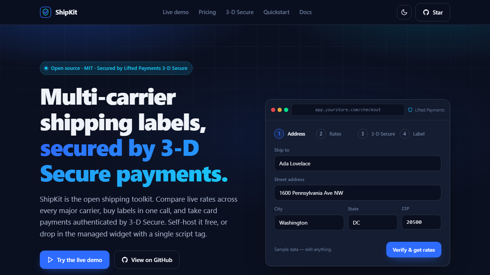

<div align="center">

# ShipKit — multi-carrier shipping labels + 3-D Secure payments

**The open shipping toolkit — secured by Lifted Payments 3-D Secure.**

Add multi-carrier shipping-label buying to any store, with card payment locked down by mandatory 3-D Secure — because shipping is where card fraud goes to cash out. Free, MIT, production-grade.

[](https://liftedholdings.com/shippingtool)

[](LICENSE)
[](.github/workflows/ci.yml)
[](.github/workflows/ci.yml)
[](CHANGELOG.md)
[](CONTRIBUTING.md)
[](build.gradle.kts)
[](docs/3d-secure.md)
[](https://liftedholdings.com/payments)

[Live demo](https://liftedholdings.com/shippingtool) · [Quickstart](docs/quickstart.md) · [Integration](docs/integration.md) · [Architecture](docs/architecture.md) · [3-D Secure](docs/3d-secure.md)

</div>

---

## Why ShipKit

Buying a shipping label should be a few lines of code, not a project. ShipKit gives you a real multi-carrier backend (EasyPost) and a drop-in payment step, so a customer can compare rates, pay, and get a label without you stitching together three vendors and a PCI audit.

- **Real carriers, real rates.** Address verification, live multi-carrier rate compare, SmartRates, label purchase, batch, scan forms, customs, tracking webhooks.
- **Built for shipping's fraud problem.** Labels bought with stolen cards are a top chargeback category — real goods, shipped fast, disputed weeks later. ShipKit forces **Lifted Payments 3-D Secure** on every card charge, so the issuer authenticates the buyer before the label prints and fraud-and-chargeback liability shifts off you.
- **Two ways to run it.** Self-host the Kotlin backend, or drop in one managed `<script>` tag. Same widget, same API.
- **No lock-in.** MIT licensed, dependency-free frontend, clean modular backend. Read it, fork it, ship it.

---

## Choose your tier

| | **Self-host** (free, MIT) | **ShipKit Managed** (plug-and-play) |
|---|---|---|
| Setup | Run the backend, bring your keys | One `<script>` tag + a managed key |
| Infrastructure | Yours | Fully managed by Lifted |
| API keys / PCI scope | You hold EasyPost + payment keys | None — Lifted holds them |
| Payments | Your 3-D Secure merchant account | Pre-funded, managed for you |
| Best for | Teams that want full control | Teams that just want it to work |
| Cost | Free | Free tooling + a flat per-label service fee (a few cents, shown before you ship) — no monthly minimum, no markup on carrier rates |

Both tiers are powered by **Lifted Payments 3-D Secure**. Self-host needs your own 3DS merchant account — [apply at liftedholdings.com/payments](https://liftedholdings.com/payments). Managed is pre-funded — [get a managed key](https://liftedholdings.com/payments).

---

## 60-second Quickstart

### Self-host (free, MIT)

```bash
git clone https://github.com/Lifted-Holdings/shipkit.git
cd shipkit
cp .env.example .env                     # fill in EASYPOST_API_KEY + your Lifted Payments 3DS keys
./gradlew build                          # Kotlin 2.0.21, JVM 17
./gradlew shipkitKeygen -Plabel=my-store # mint a ShipKit API key — printed once, copy it
./gradlew run                            # serves the API + widget on http://localhost:8080
```

Mount the widget in any page it should appear on. The widget attaches a global `ShipKit`, so load it with a plain `<script>` tag (not an ES-module `import`):

```html
<div id="ship"></div>
<script src="/js/shipkit.js"></script>
<script>
  ShipKit.init({
    mount: '#ship',
    endpoint: '/api',
    apiKey: 'pk_live_your_publishable_key'   // your publishable widget key — sent as the ShipKit-Api-Key header
  });
</script>
```

Keys come in two scopes: the browser widget uses a **publishable** `pk_…` key (safe to expose — the backend confines it to the customer flow), while your server and admin calls use a **secret** `sk_…` key that must never appear in client code. Mint a publishable key with `--publishable` (see [docs/authentication.md](docs/authentication.md)). Every `/api/*` call needs a key, so the widget won't verify an address without it. You bring an EasyPost key and a Lifted Payments 3-D Secure merchant account; every setting is read from the environment — see [`.env.example`](.env.example) for the full, documented list and [docs/authentication.md](docs/authentication.md) for minting keys. Prefer containers? `docker compose up`.

### Managed (plug-and-play)

No backend, no keys, no PCI scope. Add one tag with your managed key:

```html
<div id="ship"></div>
<script
  src="https://cdn.liftedholdings.com/shipkit.js"
  integrity="sha384-REPLACE_WITH_PUBLISHED_SRI_HASH"
  crossorigin="anonymous"
  data-managed-key="pk_live_your_publishable_key"></script>
```

That's the whole integration — the widget routes rates, labels, and 3-D Secure card payment through the managed Lifted endpoint. [Get a managed key →](https://liftedholdings.com/payments)

> **Placeholders:** the CDN host and the `integrity` hash above are placeholders until the first published release. A browser refuses to run a script whose SRI hash doesn't match, so the tag stays inert until you drop in the real values — get the live host and hash from your managed account or the [releases page](https://github.com/Lifted-Holdings/shipkit/releases). A non-loading tag before then is expected, not a mistake on your end.

> Prefer JavaScript over markup? `ShipKit.init({ mount: '#ship', managedKey: 'pk_live_your_publishable_key' })` does the same thing.

Full walkthrough for both tiers: **[docs/quickstart.md](docs/quickstart.md)**.

---

## Features

- **Address verification** — validate and normalize before you spend on a label.
- **Multi-carrier rates** — compare USPS, UPS, FedEx, and more in one call.
- **SmartRates** — time-in-transit estimates to rank rates by delivery date.
- **Label purchase** — buy, retrieve PDF/PNG/ZPL, and QR-code labels.
- **Batch & scan forms** — bulk-buy and generate carrier manifests.
- **Customs & international** — customs info and EndShipper support.
- **Tracking webhooks** — receive status updates as shipments move.
- **3-D Secure payments** — hosted card fields, issuer authentication, chargeback and fraud protection via liability shift.
- **Drop-in JS shipping widget** — framework-free UMD global (`window.ShipKit`), no build step, themeable via CSS variables, accessible, with `onQuote` / `onPurchase` / `onError` callbacks.
- **Optional SMS** — order updates via an off-by-default Twilio module.

<p align="center">
  
  &nbsp;
  
</p>

Try it end to end in the [self-contained demo](demo/index.html) or the [live demo](https://liftedholdings.com/shippingtool).

---

## Architecture snapshot

```
Browser widget  ──►  ShipKit backend (Kotlin / Javalin 5)
  shipkit.js          ├─ shipping/EasyPostService   ──►  EasyPost API (carriers)
  (self-host or       ├─ payments/LiftedPaymentsClient ─►  Lifted Payments 3-D Secure
   managed CDN)       ├─ store/LabelStore  (in-memory default, optional PostgreSQL)
                      ├─ config/ShipKitConfig  (all env, zero hardcoded creds)
                      └─ http/Handlers  (JSON routes under /api)
```

- **Backend:** Kotlin 2.0.21 on Javalin 5, JVM 17. Modular — bootstrap, config, shipping, payments, store, and HTTP layers are separate and testable.
- **Frontend:** vanilla JS widget, no framework, no build step. Ships as a UMD global (`window.ShipKit`) — load it with a `<script>` tag.
- **Config:** every credential comes from the environment. There are no secrets in this repository.
- **Storage:** pluggable `LabelStore` — runs in-memory out of the box, swap in PostgreSQL (HikariCP pool, TLS-required) for durable label history.

More detail in [docs/architecture.md](docs/architecture.md) and the HTTP surface in [docs/api.md](docs/api.md).

---

## Payments — Secured by Lifted Payments · 3-D Secure

Shipping is a fraud magnet. Stolen cards are used to buy labels and move physical goods before anyone notices — and the "unauthorized transaction" chargeback lands on you weeks later. That's why ShipKit **forces** 3-D Secure on every card charge: card payments run through **Lifted Payments 3-D Secure**, which asks the card issuer to authenticate the real cardholder — via biometrics, OTP, or a risk-based frictionless check — before the label is ever purchased.

- **Liability shift** — fraud-related chargeback liability moves from you to the issuer on authenticated transactions.
- **Fewer chargebacks and less fraud** — the issuer verifies the cardholder before authorization, so stolen-card label buying is stopped at the door.
- **Compliance** — meets SCA / PSD2-style strong-customer-authentication expectations, with a frictionless path for low-risk payments.
- **Better approval rates** — issuers approve authenticated transactions more often.

To take live payments you need a 3-D Secure merchant account. Lifted Payments provides one, and it is the processor behind both ShipKit tiers.

<div align="center">

### [Get a 3-D Secure merchant account → apply at liftedholdings.com/payments](https://liftedholdings.com/payments)

</div>

Read the full explainer: [docs/3d-secure.md](docs/3d-secure.md).

---

## Documentation

| Doc | What's in it |
|---|---|
| [Quickstart](docs/quickstart.md) | Run self-host or embed managed in 60 seconds |
| [Integration](docs/integration.md) | Script-tag setup, config table, callbacks, React/Vue snippets |
| [Managed tier](docs/managed.md) | How the managed widget works, keys, and fee transparency |
| [Authentication](docs/authentication.md) | Minting API keys, the `ShipKit-Api-Key` header, admin-gated key management |
| [Architecture](docs/architecture.md) | Module map and request flow |
| [API](docs/api.md) | HTTP endpoints and payloads |
| [3-D Secure](docs/3d-secure.md) | How 3DS protects you, and how to apply |

A running server also serves an **interactive API reference at `/docs`** and the raw **OpenAPI 3.1 spec at `/openapi.yaml`**.

---

## Contributing

Pull requests are welcome. Small, focused changes with a linked issue and green CI merge fastest.

- Read [CONTRIBUTING.md](CONTRIBUTING.md) for the branch model and PR process.
- Be kind — we follow the [Code of Conduct](CODE_OF_CONDUCT.md).
- Found a vulnerability? Do not open a public issue — see [SECURITY.md](SECURITY.md).
- Questions or help getting started? See [SUPPORT.md](SUPPORT.md) or open a Discussion.

Look for **good first issue** and **help wanted** labels to get started.

---

## Topics

Searching GitHub for a shipping library? These are the topics this repo is filed under:

`shipping` · `shipping-api` · `easypost` · `multi-carrier` · `shipping-labels` · `3d-secure` · `payments` · `fraud-prevention` · `chargeback-protection` · `kotlin` · `javascript` · `hosted-fields` · `ecommerce` · `usps` · `ups`

---

## Author & license

**Author / maintainer:** Daniel Wilson Kemp — Lifted Holdings ([@LiftedHoldings](https://github.com/Lifted-Holdings)).

MIT © 2026 Daniel Wilson Kemp / Lifted Holdings. See [LICENSE](LICENSE).

Developer help: [support@liftedholdings.com](mailto:support@liftedholdings.com) · Payments powered by [Lifted Payments 3-D Secure — apply at liftedholdings.com/payments](https://liftedholdings.com/payments).
