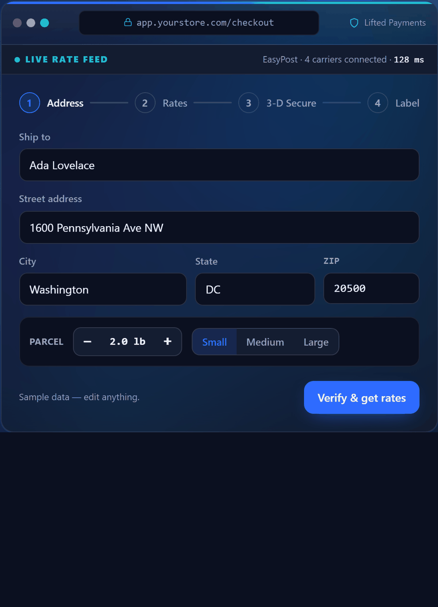
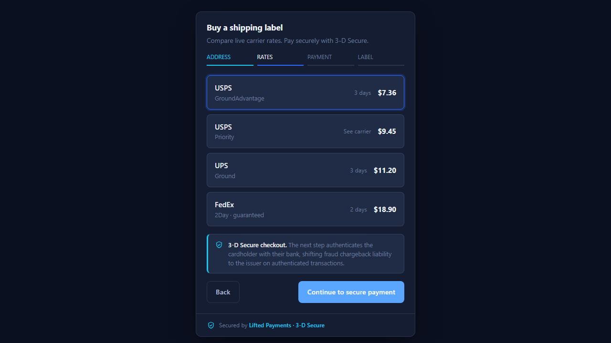

<div align="center">


# Lifted ShipKit — multi-carrier shipping labels + 3-D Secure payments

**The open shipping toolkit — secured by Lifted Payments 3-D Secure.**

Add multi-carrier shipping-label buying to any store, with card payment locked down by mandatory 3-D Secure — because shipping is where card fraud goes to cash out. Free, MIT, production-grade.

<a href="https://liftedholdings.com/shippingtool"></a>

[](LICENSE)
[](https://github.com/LiftedHoldings/lifted-shipkit/actions/workflows/ci.yml)
[](https://codecov.io/gh/LiftedHoldings/lifted-shipkit)
[](CHANGELOG.md)
[](CONTRIBUTING.md)
[](build.gradle.kts)
[](docs/3d-secure.md)
[](https://liftedholdings.com/payments)

[](https://god.gw.postman.com/run-collection/36630865-bd2412e8-cfe6-42e4-9fe6-e3ae9d025750?action=collection%2Ffork)

[Live demo](https://liftedholdings.com/shippingtool) · [Quickstart](docs/quickstart.md) · [Integration](docs/integration.md) · [Architecture](docs/architecture.md) · [3-D Secure](docs/3d-secure.md) · [Open in Postman](https://god.gw.postman.com/run-collection/36630865-bd2412e8-cfe6-42e4-9fe6-e3ae9d025750?action=collection%2Ffork)

</div>

---

**Contents:** [Why ShipKit](#why-shipkit) · [How ShipKit compares](#how-shipkit-compares) · [Choose your tier](#choose-your-tier) · [Quickstart](#60-second-quickstart) · [Drop into your checkout](#drop-shipkit-into-your-own-checkout) · [Features](#features) · [Architecture](#architecture-snapshot) · [Payments & 3-D Secure](#payments--secured-by-lifted-payments--3-d-secure) · [Documentation](#documentation) · [Postman](#import-into-postman) · [Contributing](#contributing)

> **No account needed to try it:** open [`demo/index.html`](demo/index.html) — a single self-contained file (no backend, no keys) with the full widget flow, including the 3-D Secure moment. **[Add shipping to your own checkout in 3 lines →](#drop-shipkit-into-your-own-checkout)**

---

## Why ShipKit

Buying a shipping label should be a few lines of code, not a project. Lifted ShipKit gives you a real multi-carrier backend (EasyPost) and a drop-in payment step, so a customer can compare rates, pay, and get a label without you stitching together three vendors and a PCI audit.

- **Real carriers, real rates.** Address verification, live multi-carrier rate compare, SmartRates, label purchase, batch, scan forms, customs, tracking webhooks.
- **Shipping is a profit center, not a pass-through.** Whoever owns the payments account owns the markup: price every label at carrier rate **plus your own percentage and fixed fee** (`percentage_markup` + `fixed_fee_cents`, applied server-side, shown at checkout). Self-host or run on a Lifted 3-D Secure merchant account — [apply at liftedholdings.com/payments](https://liftedholdings.com/payments) — and that margin is 100% yours on every label; on the managed tier the markup is how we earn instead, which is what keeps managed free.
- **Built for shipping's fraud problem.** Labels bought with stolen cards are a top chargeback category — real goods, shipped fast, disputed weeks later. ShipKit forces **Lifted Payments 3-D Secure** on every card charge, so the issuer authenticates the buyer before the label prints and fraud-and-chargeback liability shifts off you.
- **Three ways to run it.** Self-host it all, put your checkout on our 3-D Secure merchant account, or drop in one managed `<script>` tag. Same widget, same API.
- **No lock-in.** MIT licensed, dependency-free frontend, clean modular backend. Read it, fork it, ship it.

---

## How ShipKit compares

Most teams stitch a rating API to a payment processor and then own the PCI scope and stolen-card chargebacks themselves. ShipKit is that stack, already assembled and hardened — **the only open-source, self-hostable multi-carrier shipping kit with forced 3-D Secure and a drop-in checkout widget.**

| | **ShipKit** | Raw EasyPost | Shippo / ShipEngine | EasyPost + Stripe (DIY) |
|---|---|---|---|---|
| Multi-carrier rates & labels | ✅ | ✅ | ✅ | ✅ |
| Card payment built in | ✅ | ❌ | ❌ | You wire it |
| **Forced 3-D Secure / liability shift** | ✅ **always on** | ❌ | ❌ | Only if you build it |
| Drop-in widget (no build step) | ✅ `window.ShipKit` | ❌ | ❌ | ❌ |
| Open-source & self-hostable | ✅ MIT | ❌ SaaS | ❌ SaaS | Partly |
| Per-label / SaaS fee | **None** (self-host) | Per-label | Per-label | Two vendors' fees |
| PCI scope for card data | Out of scope (hosted fields) | n/a | n/a | **Yours** |

Shipping coverage comes from EasyPost (ShipKit's carrier backend) — same USPS/UPS/FedEx rates, with the payment + 3DS + widget layer added on top. Full side-by-side, including "vs. rolling your own": **[docs/comparison.md](docs/comparison.md)**.

---

## Choose your tier

ShipKit comes in three tiers — pick how much you want to run yourself. All three are powered by **Lifted Payments 3-D Secure**.

| | **1 · Self-host** · DIY, free | **2 · Lifted 3-D Secure merchant account** | **3 · Fully managed** · plug & play |
|---|---|---|---|
| What you run | Everything — your own rails | Your checkout on **our** 3DS merchant account | One JS snippet on **our** rails |
| Payments | Your own processor | **Our** 3-D Secure merchant account | **Our** 3-D Secure account |
| EasyPost (carriers) | Your own account | Your own account | **Ours** — included |
| Hosting | You host | **You host _or_ we host — both free** | We host — free |
| PCI scope for card data | Yours | Out of scope (hosted 3DS form) | Out of scope (hosted 3DS form) |
| Cost | **Free** (MIT) | **3.75% + $0.15 / transaction + $25 / month** — the merchant account only¹ | **Free** — we earn on the shipping rate² |
| Shipping-rate markup | **Yours** — % + fixed fee per label, keep 100% | **Yours** — % + fixed fee per label, keep 100% | Ours — it's what funds the free tier |
| Best for | Full control, heaviest dev work | Our processing, your choice of host | "Just make it work" |
| Get started | [GitHub](https://github.com/LiftedHoldings/lifted-shipkit) · [support@](mailto:support@liftedholdings.com) | [Apply → liftedholdings.com/payments](https://liftedholdings.com/payments) | [Create free account → get the JS](https://liftedholdings.com/shipkit/start) |

¹ The **3.75% + 15¢** processing cost can be **surcharged to the buyer** with a built-in surcharge-framework toggle, so the per-transaction fee lands on the cardholder rather than on you. The **$25/month** is the standard merchant-account fee.
² **Managed** needs **no merchant-account application** — you just create a free account (name, email, company) and instantly get your plug-and-play JS snippet and managed key. It runs on our 3DS account and our EasyPost with free hosting; we make our margin on a **configurable markup over the carrier's shipping rate** (set via `POST /api/config/markup`), shown at checkout before the buyer pays. Carrier rates, the code, the widget, and self-hosting stay free.

Full side-by-side breakdown with the exact numbers: **[docs/tiers.md](docs/tiers.md)**.

> Two Lifted links, two jobs: the **live demo** is at **[liftedholdings.com/shippingtool](https://liftedholdings.com/shippingtool)** (also served at /shipkit) — play with it; you **create a free managed account** and get your snippet at **[liftedholdings.com/shipkit/start](https://liftedholdings.com/shipkit/start)**.

### Need something custom?

Want ShipKit woven into your own framework, or a bespoke build on top of it? We do **custom integration and software development** — tell us what you're building: **[support@liftedholdings.com](mailto:support@liftedholdings.com)**.

---

## 60-second Quickstart

### One-command demo (Docker)

Already have Docker? Pull and run the published image — no clone, no build:

```bash
docker run --rm -e SHIPKIT_PORT=8080 -p 8080:8080 ghcr.io/liftedholdings/lifted-shipkit
```

Then open **http://localhost:8080**. The image is built and pushed to the GitHub Container Registry by CI on each release (and every push to `main`). Shipping and payment features stay in `503` until you supply an EasyPost key and Lifted Payments 3DS credentials as `-e` vars — see the self-host env table below — but the widget and demo pages come up immediately.

> **First publish:** GHCR packages default to private. After the first CI publish, set the `shipkit` package to **Public** in the repo's package settings so `docker pull` works without a login. One-time step — see [docs/quickstart.md](docs/quickstart.md#one-command-demo-docker).

### Self-host (free, MIT)

```bash
git clone https://github.com/LiftedHoldings/lifted-shipkit.git
cd shipkit
cp .env.example .env                     # fill in EASYPOST_API_KEY + your Lifted Payments 3DS keys
./gradlew build                          # Kotlin 2.0.21, JVM 17
./gradlew shipkitKeygen -Plabel=my-store # mint a ShipKit API key — printed once, copy it
./gradlew run                            # serves the API + widget on http://localhost:8080
```

Mount the widget in any page it should appear on. The widget attaches a global `ShipKit`, so load it with a plain `<script>` tag (not an ES-module `import`):

```html
<div id="ship"></div>
<script src="/js/shipkit.js"></script>
<script>
  ShipKit.init({
    mount: '#ship',
    endpoint: '/api',
    apiKey: 'pk_live_your_publishable_key'   // your publishable widget key — sent as the ShipKit-Api-Key header
  });
</script>
```

Keys come in two scopes: the browser widget uses a **publishable** `pk_…` key (safe to expose — the backend confines it to the customer flow), while your server and admin calls use a **secret** `sk_…` key that must never appear in client code. Mint a publishable key with `--publishable` (see [docs/authentication.md](docs/authentication.md)). Every `/api/*` call needs a key, so the widget won't verify an address without it. You bring an EasyPost key and a Lifted Payments 3-D Secure merchant account; every setting is read from the environment — see [`.env.example`](.env.example) for the full, documented list and [docs/authentication.md](docs/authentication.md) for minting keys. Prefer containers? `docker compose up`.

### Managed (plug-and-play)

No application, no infra — [create a free account](https://liftedholdings.com/shipkit/start), get your managed key, and add one tag:

```html
<div id="ship"></div>
<script
  src="https://cdn.liftedholdings.com/shipkit.js"
  integrity="sha384-REPLACE_WITH_PUBLISHED_SRI_HASH"
  crossorigin="anonymous"
  data-managed-key="pk_live_your_publishable_key"></script>
```

That's the whole integration — the widget routes rates, labels, and 3-D Secure card payment through the managed Lifted endpoint. [Create your free account → get the JS](https://liftedholdings.com/shipkit/start)

> **Placeholders:** the CDN host and the `integrity` hash above are placeholders until the first published release. A browser refuses to run a script whose SRI hash doesn't match, so the tag stays inert until you drop in the real values — get the live host and hash from your managed account or the [releases page](https://github.com/LiftedHoldings/lifted-shipkit/releases). A non-loading tag before then is expected, not a mistake on your end.

> Prefer JavaScript over markup? `ShipKit.init({ mount: '#ship', managedKey: 'pk_live_your_publishable_key' })` does the same thing.

**Hosting ShipKit for others?** Two optional, env-driven hooks make a fleet of instances operable from a control plane, and both are OFF by default: set `SHIPKIT_MANAGED_CONFIG_TOKEN` to let your platform update the shipping markup remotely (`POST /api/config/markup` with `Authorization: Bearer <token>`, accepting a `{markup_pct, fixed_fee}` percent-and-dollars body) and provision tenant API keys remotely (`POST`/`GET /api/config/keys`, `DELETE /api/config/keys/{id}` — mint `pk`/`sk` keys, reconcile metadata, revoke; bearer-only and disabled when the token is unset), and set `SHIPKIT_EVENTS_WEBHOOK_URL` (+ optional `SHIPKIT_EVENTS_WEBHOOK_TOKEN`) to receive a fire-and-forget `label.purchased` webhook for every successful purchase — carrier cost and buyer charge in integer cents plus the markup applied, tenant identified by the non-secret key prefix, never blocking a sale. Details in [`.env.example`](.env.example).

Full walkthrough for both tiers: **[docs/quickstart.md](docs/quickstart.md)**.

---

## Drop ShipKit into your own checkout

The headline use case: keep your app and your checkout, and add ShipKit for the rate-compare → pay → print-label step. The widget is a **dependency-free UMD global** (`window.ShipKit`) — no build step, no framework, no lock-in. Mount a node, point it at your backend (or a managed key), wire three callbacks into your order flow. That's the entire integration surface.

```html
<div id="ship"></div>
<script src="/js/shipkit.js"></script>
<script>
  ShipKit.init({
    mount: '#ship',
    endpoint: '/api',                          // your ShipKit backend (self-host)
    apiKey: 'pk_live_your_publishable_key',    // publishable pk_… key — safe in the browser
    onPurchase: ({ trackingCode, labelUrl }) => {
      // hand the finished label back to your order flow
    }
  });
</script>
```

- **React, Next.js, Vue, Svelte, TypeScript, or plain HTML** — copy-paste components in [`examples/`](src/main/resources/public/examples/) and the [integration guide](docs/integration.md#framework-snippets). Types ship in [`shipkit.d.ts`](src/main/resources/public/examples/shipkit.d.ts); a server-side Node example is in [`server-node.js`](src/main/resources/public/examples/server-node.js).
- **Full `init` config, callbacks, theming** — the complete reference: [docs/integration.md](docs/integration.md).
- **Match your brand** — restyle every surface with the `--sk-*` CSS variables; no `!important`, no build.
- **No backend to run?** Swap `endpoint` + `apiKey` for a single `managedKey` — [Managed](docs/managed.md).

Fork it, read it, ship it — MIT, zero lock-in.

---

## Features

- **Address verification** — validate and normalize before you spend on a label.
- **Multi-carrier rates** — compare USPS, UPS, FedEx, and more in one call.
- **SmartRates** — time-in-transit estimates to rank rates by delivery date.
- **Label purchase** — buy, retrieve PDF/PNG/ZPL, and QR-code labels.
- **Batch & scan forms** — bulk-buy and generate carrier manifests.
- **Customs & international** — customs info and EndShipper support.
- **Tracking webhooks** — receive status updates as shipments move.
- **3-D Secure payments** — hosted card fields, issuer authentication, chargeback and fraud protection via liability shift.
- **Drop-in JS shipping widget** — framework-free UMD global (`window.ShipKit`), no build step, themeable via CSS variables, accessible, with `onQuote` / `onPurchase` / `onError` callbacks.
- **Optional SMS** — order updates via an off-by-default Twilio module.

<p align="center">
  
  &nbsp;
  
</p>

Try it end to end in the [self-contained demo](demo/index.html) or the [live demo](https://liftedholdings.com/shippingtool).

---

## Architecture snapshot

```
Browser widget  ──►  ShipKit backend (Kotlin / Javalin 5)
  shipkit.js          ├─ shipping/EasyPostService   ──►  EasyPost API (carriers)
  (self-host or       ├─ payments/LiftedPaymentsClient ─►  Lifted Payments 3-D Secure
   managed CDN)       ├─ store/LabelStore  (in-memory default, optional PostgreSQL)
                      ├─ config/ShipKitConfig  (all env, zero hardcoded creds)
                      └─ http/Handlers  (JSON routes under /api)
```

- **Backend:** Kotlin 2.0.21 on Javalin 5, JVM 17. Modular — bootstrap, config, shipping, payments, store, and HTTP layers are separate and testable.
- **Frontend:** vanilla JS widget, no framework, no build step. Ships as a UMD global (`window.ShipKit`) — load it with a `<script>` tag.
- **Config:** every credential comes from the environment. There are no secrets in this repository.
- **Storage:** pluggable `LabelStore` — runs in-memory out of the box, swap in PostgreSQL (HikariCP pool, TLS-required) for durable label history.

More detail in [docs/architecture.md](docs/architecture.md) and the HTTP surface in [docs/api.md](docs/api.md).

---

## Payments — Secured by Lifted Payments · 3-D Secure

Shipping is a fraud magnet. Stolen cards are used to buy labels and move physical goods before anyone notices — and the "unauthorized transaction" chargeback lands on you weeks later. That's why ShipKit **forces** 3-D Secure on every card charge: card payments run through **Lifted Payments 3-D Secure**, which asks the card issuer to authenticate the real cardholder — via biometrics, OTP, or a risk-based frictionless check — before the label is ever purchased.

- **Liability shift** — fraud-related chargeback liability moves from you to the issuer on authenticated transactions.
- **Fewer chargebacks and less fraud** — the issuer verifies the cardholder before authorization, so stolen-card label buying is stopped at the door.
- **Compliance** — meets SCA / PSD2-style strong-customer-authentication expectations, with a frictionless path for low-risk payments.
- **Better approval rates** — issuers approve authenticated transactions more often.

### Frictionless checkout & saved cards — on our rails only

Forced 3-D Secure is the **default and the only self-host mode — self-host cannot turn 3DS off** (the charge path sends `3ds: true` unconditionally; there is no flag, config, or widget option to disable it). Merchants on a **Lifted Payments tier (2 or 3)** or an **enterprise build** can opt into **frictionless mode** — a faster `3ds`-off checkout plus **saved cards on file** (tokenized customer vault for repeat / one-tap charges). It is an account-level, **server-side** capability tied to your tier — never a client or widget toggle, and never available to bring-your-own-payments.

| | Self-host / bring-your-own-payments | Frictionless on Lifted's rails · tier 2/3 · enterprise |
|---|---|---|
| 3-D Secure | **Forced — cannot be disabled** | Optional, per account (`3ds` off) |
| Saved cards on file | Not available | Tokenized customer vault (repeat / one-tap) |
| Where it's set | n/a — always on | Server-side, tied to the account/tier |

Full breakdown: [forced 3-D Secure vs. frictionless mode](docs/3d-secure.md#forced-3-d-secure-vs-frictionless-mode-account-gated). Want frictionless + card-on-file, or a bespoke build? **[support@liftedholdings.com](mailto:support@liftedholdings.com)**.

To take live payments on your own account you need a 3-D Secure merchant account. Lifted Payments provides one, and it is the processor behind every ShipKit tier — your own account on the [merchant-account tier](docs/tiers.md#tier-2--lifted-3-d-secure-merchant-account), and ours on the [fully-managed tier](docs/tiers.md#tier-3--fully-managed-plug--play).

<div align="center">

### [Get a 3-D Secure merchant account → apply at liftedholdings.com/payments](https://liftedholdings.com/payments)

</div>

Read the full explainer: [docs/3d-secure.md](docs/3d-secure.md).

---

## Documentation

| Doc | What's in it |
|---|---|
| [Comparison](docs/comparison.md) | ShipKit vs EasyPost, Shippo, ShipEngine, and rolling your own |
| [Tiers & pricing](docs/tiers.md) | The three tiers side by side, with exact pricing and the surcharge toggle |
| [Quickstart](docs/quickstart.md) | Run self-host or embed managed in 60 seconds |
| [Integration](docs/integration.md) | Script-tag setup, config table, callbacks, React/Vue snippets |
| [Managed tier](docs/managed.md) | How the managed widget works, keys, and how the shipping-rate markup funds it |
| [Authentication](docs/authentication.md) | Minting API keys, the `ShipKit-Api-Key` header, admin-gated key management |
| [Architecture](docs/architecture.md) | Module map and request flow |
| [API](docs/api.md) | HTTP endpoints and payloads |
| [3-D Secure](docs/3d-secure.md) | How 3DS protects you, and how to apply |

A running server also serves an **interactive API reference at `/docs`** and the raw **OpenAPI 3.1 spec at `/openapi.yaml`**.

---

## Import into Postman

[](https://god.gw.postman.com/run-collection/36630865-bd2412e8-cfe6-42e4-9fe6-e3ae9d025750?action=collection%2Ffork)

One click forks the live **ShipKit API** collection into your own Postman. Prefer to do it by hand?

1. **Import the collection** — [`shipkit.postman_collection.json`](shipkit.postman_collection.json) (Postman Collection v2.1). In Postman, choose **Import → File** and pick the JSON, or drag it into the sidebar.
2. **Set two collection variables** — `baseUrl` (e.g. `http://localhost:8080`) and `apiKey` (a ShipKit `sk_…` secret key, or a `pk_…` publishable key for the customer-flow routes). Admin-gated key management also reads `adminSessionId`.
3. **Send.** Auth is wired at the collection level, so the `ShipKit-Api-Key: {{apiKey}}` header rides on every `/api/*` request automatically — `GET /api/health` and the HMAC-verified EasyPost webhook are exempt. Requests are grouped into **Shipping**, **Payments**, **Keys**, and **Admin** folders, each with a ready-to-edit example body.

Prefer OpenAPI? A running server serves the raw spec at **`/openapi.yaml`** and an interactive reference at **`/docs`** — see [docs/api.md](docs/api.md).

---

## Contributing

Pull requests are welcome. Small, focused changes with a linked issue and green CI merge fastest.

- Read [CONTRIBUTING.md](CONTRIBUTING.md) for the branch model and PR process.
- Be kind — we follow the [Code of Conduct](CODE_OF_CONDUCT.md).
- Found a vulnerability? Do not open a public issue — see [SECURITY.md](SECURITY.md).
- Questions or help getting started? See [SUPPORT.md](SUPPORT.md) or open a Discussion.

New contributor? Start with a curated, scoped task from **[docs/good-first-issues.md](docs/good-first-issues.md)**, or look for the **good first issue** and **help wanted** labels.

---

## Topics

Searching GitHub for a shipping library? These are the topics this repo is filed under:

`shipping` · `shipping-api` · `easypost` · `multi-carrier` · `shipping-labels` · `3d-secure` · `payments` · `fraud-prevention` · `chargeback-protection` · `kotlin` · `javascript` · `hosted-fields` · `ecommerce` · `usps` · `ups`

---

## Author & license

**Author / maintainer:** Daniel Wilson Kemp — Lifted Holdings ([@LiftedHoldings](https://github.com/LiftedHoldings)).

MIT © 2026 Daniel Wilson Kemp / Lifted Holdings. See [LICENSE](LICENSE).

Developer help: [support@liftedholdings.com](mailto:support@liftedholdings.com) · Payments powered by [Lifted Payments 3-D Secure — apply at liftedholdings.com/payments](https://liftedholdings.com/payments).
